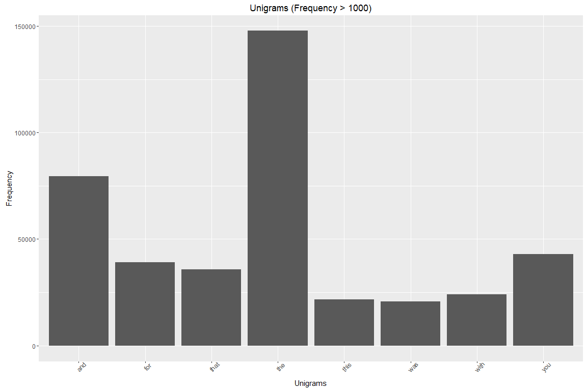
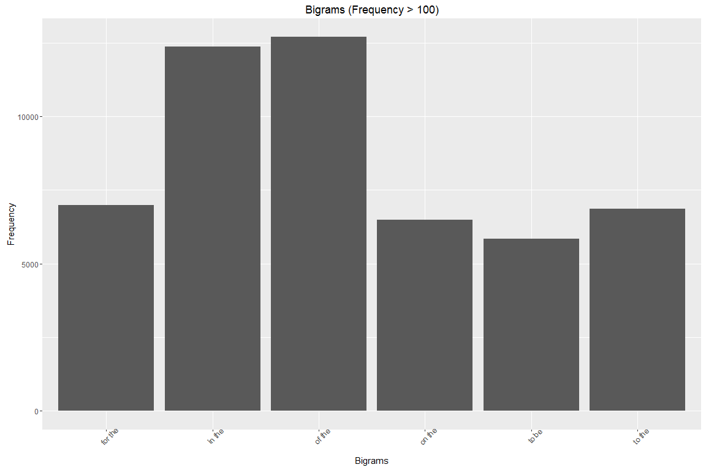

#Data Science Capstone
###Milestone Report: MR_template


###1. Introduction
This document presents the results of the Milestone Report for the Coursera course: Data Science Capstone. This assessment required the student to apply data science techniques in the area of natural language processing by building a predictive text application. The application is to be capable of scanning a stream of text as it is typed by a user and suggest possibilities for the next word to be appended to the input stream. The application is to be demonstrated via the Shiny platform, which will allow users to type an input text stream and receive a text predictions within a web based environment.

The goal of the Milestone Report is to demonstrate that the student has gotten used to working with the data and that they are on track to create the predictive text mining application. This report mirrors the structure of the Milestone Report grading rubic:
- Demonstrate that you've downloaded the data and have successfully loaded it in.
- Create a basic report of summary statistics about the data sets.
- Report any interesting findings that you amassed so far.
- Get feedback on your plans for creating a prediction algorithm and Shiny app.


###2. Data
This assessment makes use of raw text data from three sources (news headlines, blog entries, and user tweets). Datasets were made available in German, Russian and English, however only the English datasets were utilized as part of this project.

* Dataset: [training data](https://d396qusza40orc.cloudfront.net/dsscapstone/dataset/Coursera-SwiftKey.zip)


###3. Loading Packages/ Data
The first step is to read each of the English datasets into R.

```r
data_twitter.raw <- readLines("data/en_US/en_US.twitter.txt", encoding = "UTF-8")
data_news.raw <- readLines("data/en_US/en_US.news.txt", encoding = "UTF-8")
data_blogs.raw <- readLines("data/en_US/en_US.blogs.txt", encoding = "UTF-8")
data.raw <- c(data_twitter.raw, data_news.raw, data_blogs.raw)
```


###4. Preliminary Analysis
Some preliminary analysis is conducted on the raw datasets, based on the first Quiz Set. The below table shows a sumamry of each of the datasets which were read into R above.

|File (name)       |Size (mb) |Lines (no.) |Longest Line (chars) |
|:-----------------|:---------|:-----------|:--------------------|
|en_US.twitter.txt |159.36    |2360148     |140                  |
|en_US.news.txt    |196.28    |77259       |5760                 |
|en_US.blogs.txt   |200.42    |899288      |40833                |

The en_US.blogs.txt file is how many megabytes?

```r
file.info("data/en_US/en_US.blogs.txt")$size/1024^2
```

```
## [1] 200.4242
```

The en_US.twitter.txt has how many lines of text?

```r
length(data_twitter.raw)
```

```
## [1] 2360148
```

What is the length of the longest line seen in any of the three en_US data sets? 

```r
max(nchar(data_twitter.raw))
```

```
## [1] 140
```

In the en_US twitter data set, if you divide the number of lines where the word "love" (all lowercase) occurs by the number of lines the word "hate" (all lowercase) occurs, about what do you get?

```r
val_love <- sum(grepl(pattern = "love", x = data_twitter.raw))
val_hate <- sum(grepl(pattern = "hate", x = data_twitter.raw))
val_love / val_hate
```

```
## [1] 4.108592
```

```r
rm(val_love, val_hate)
```

The one tweet in the en_US twitter data set that matches the word "biostats" says what?

```r
data_twitter.raw[grep(pattern = "biostat", x = data_twitter.raw)]
```

```
## [1] "i know how you feel.. i have biostats on tuesday and i have yet to study =/"
```

How many tweets have the exact characters "A computer once beat me at chess, but it was no match for me at kickboxing". (I.e. the line matches those characters exactly.) 

```r
sum(grepl(pattern = "A computer once beat me at chess, but it was no match for me at kickboxing", x = data_twitter.raw))
```

```
## [1] 3
```


###5. Pre-process the Data
Due to the scale of each dataset, a sample of 5,000 lines is taken prior to any pre-processing.

```r
set.seed(1)
data_twitter.smpl <- data_twitter.raw[sample(1:length(data_twitter.raw), length(data_twitter.raw) * 0.05)]
data_news.smpl <- data_news.raw[sample(1:length(data_news.raw), length(data_news.raw) * 0.05)]
data_blogs.smpl <- data_blogs.raw[sample(1:length(data_blogs.raw), length(data_blogs.raw) * 0.05)]
data.smpl <- c(data_twitter.smpl, data_news.smpl, data_blogs.smpl)

data.train <- data.smpl
#data.train <- data.raw

rm(data_twitter.raw, data_news.raw, data_blogs.raw)
#rm(data_twitter.smpl, data_news.smpl, data_blogs.smpl)
```

A number of transformations are made as part of the pre-processing routine. The table delow summarizes each transformation and the order in which they are applied.

|Order |Transformation                            |
|:-----|:-----------------------------------------|
|1     |Convert from UTF-8 to ASCII               |
|2     |Remove retweet entities                   |
|3     |Remove @people                            |
|4     |Remove http addressess                    |
|5     |Remove punctuation                        |
|6     |Remove digits                             |
|7     |Remove English stopwords (e.g. to, a, is) |
|8     |Remove profanity                          |
|9     |Convert text to lowercase                 |
|10    |Strip all whitespace                      |


A Term Document Matrix is then created which consists of each document as columns and distinct words as rows. A seperate Term Document Matrix is created for four possible N-gram sequences:
1) Unigrams: Single N-gram (e.g. I / really / love / Swiftkey)
2) Bigrams: Two joining N-grams (e.g. I really / love Swiftkey)
3) Trigrams: Three joining N-grams (e.g. I really love / really love Swiftkey)
4) Quadgrams: Four joing N-grams (e.g. I really love Switftkey)

In order to create the Term Document Matrix, we start by applying a word tokenizer to specify how many words are needed for that specific N-gram. We then create a method that takes a corpus and the N-gram size that iterates through each of the sampled datasets and applies the tokenizer so we end up with a corpus of the same amount of documents with the tokenizer applied.

```
##            used  (Mb) gc trigger  (Mb) max used  (Mb)
## Ncells  9536516 509.4   17371378 927.8 17371378 927.8
## Vcells 76744240 585.6  123769707 944.3 96321216 734.9
```


###6. Exploratory Analysis
Finally, as part of the exploratory analysis routine, attention is drawn to word frequency and correlations. A word cloud is also prepared to better visualize each N-gram frequency's.

The plots and table extracts below show the most common word frequencies for each N-gram:
 

```
## [1] "Unigrams - Top 10 highest frequencies"
```

```
##        ngram   freq
## 99252    the 147781
## 3398     and  79610
## 113313   you  42839
## 36061    for  39029
## 99145   that  35884
## 110654  with  24128
## 99962   this  21562
## 108296   was  20629
## 43311   have  19987
## 4714     are  18167
```

 

```
## [1] "Bigrams - Top 10 highest frequencies"
```

```
##          ngram  freq
## 665492  of the 12698
## 469767  in the 12370
## 352135 for the  6983
## 988370  to the  6867
## 677125  on the  6488
## 980842   to be  5851
## 90792   at the  4588
## 453226  i have  4108
## 61715  and the  3886
## 486214    is a  3775
```

 

```
## [1] "Trigrams - Top 10 highest frequencies"
```

```
##                      ngram freq
## 1789954     thanks for the 1194
## 1382989         one of the 1082
## 24491             a lot of  934
## 1981047            to be a  669
## 897980           i want to  633
## 740800         going to be  606
## 885934            i have a  562
## 1119301 looking forward to  524
## 1788972      thank you for  506
## 886569           i have to  503
```

 

```
## [1] "Quadgrams - Top 10 highest frequencies"
```

```
##                                     ngram freq
## 2093497             thanks for the follow  326
## 2500056 vested interests vested interests  251
## 1144166 interests vested interests vested  250
## 2215049                   the rest of the  244
## 2158097                    the end of the  243
## 280053                      at the end of  196
## 772055                 for the first time  180
## 450665                   cant wait to see  177
## 2093620                 thanks for the rt  172
## 281567                   at the same time  167
```

A visual representation of unigram correlations is shown below:
 

Finally, a word cloud is generated for each N-gram combination.
    

###7. Key Findings
There are long computation times associated with reading in and transforming the datasets. I imagine the the long computation time is due to the large file size of each dataset and inefficiencies of using the tm package without distributed computing techniques. As such, it was vital to create a data sample for text mining and tokenization. However, this workaround decreases the accuracy for the subsequent predictions.

Analysis of some of the higher N-gram frequencies suggests that there is scope to futher improve the cleaning routine. For example, "incorporated item c pp" appeared as one of the top 10 most frequent quadgrams for a sample size of 2% of the original dataset. In order to further improve on the applied cleaning routine, I will investigate applying some additional transformations including stemming words to their root form and correcting common spelling mistakes.

I debated whether to remove stopwords from the corpus. At this stage, I will progress with building the predictive text model including stopwords, but may vary this depending on the model's performance.


###8. Next steps: N-gram Model
Once satisfied with the cleaning routine, the next steps include building the predictive text model and implementing the model via the Shiny Platform. Based on what I have read thus far, my initial efforts will be put towards implementing an N-gram probabilitstic model (Maximum Likelihood Estimation) based on the Stupid Backoff alogithm. Such a model should be fairly easy to implement and should bring advantages of speed and scalability. If I have time, I will also investigate implementing a smoothing algorithm such as Kneser-Ney for improved prediction accuracy.

An N-gram model is a probabilistic language model for predicting the next token from a provided sequence of N-grams. Being a probabilistic model, the model outputs a probability distribution of likely words (rather than a single prediction) where the probability of that word is determined by the relative frequency of the N-gram sequence in the corpus of training data.

The Stupid Backoff (Brants et al 2007)  algorithm provides one possible option to implement a N-gram probability distribution over a set of N-gram orders. This algorithm checks if highest-order N-gram occurs within the training data, and if not, it 'backs-off' to a lower-order N-gram model. The Stupid Backoff algorith is commonly used within web based application since this algorithm is designed to deliever fast predictions for large datasets.

A common issue with the N-gram model however, is the balance weight between infrequent and frequent N-grams within the training data. That is, N-grams not seen within the training data will be given a probability of zero. It is therefore desirable to smooth the probability distributions in order to produce more accurate probabilities.

The Kneser-Ney provides provides one possible option to improve the N-gram probability distribution by making use of absolute discounting by subtracting a fixed value from the probability's lower order terms in order to omit N-grams with lower frequencies. The result is a greater probability weight to higher-order N-grams which at a high level, can be seen to provide a greater amount of context than lower-order N-grams.


