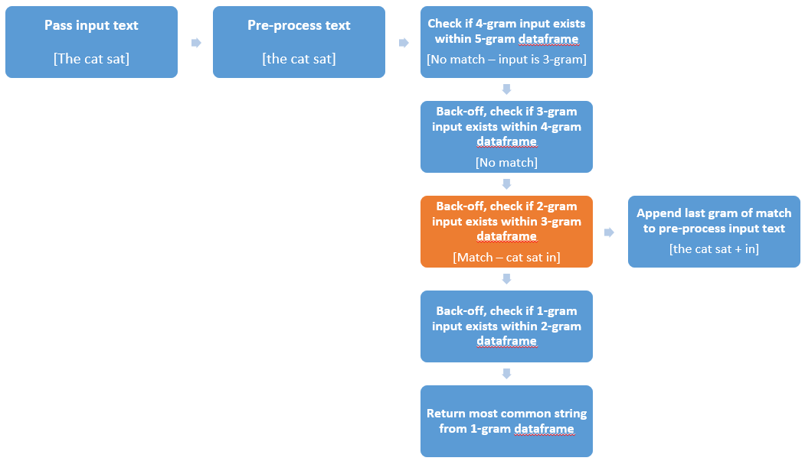

---
title       : Coursera Data Science Capstone
subtitle    : Application Pitch
author      : Darryl Buswell (www.github.com/buswedg)
framework   : io2012                        # {io2012, html5slides, shower, dzslides, ...}
hitheme     : tomorrow                      #
widgets     : [mathjax, quiz, bootstrap]    # {mathjax, quiz, bootstrap}
mode        : selfcontained                 # {standalone, draft}
--- .class #id

# Some Background
___

### Assessment

This assessment required the student to apply data science techniques in the area of natural language processing by building a predictive text application.

### Application

The application is to be capable of scanning a stream of text as it is typed by a user and suggest possibilities for the next word to be appended to the input stream. The application is to be demonstrated via the Shiny platform, which will allow users to type an input text stream and receive a text predictions within a web based environment.

--- .class #id

# About the Algorithm
___

### Alogirthm Overview

The algorithm is based on an N-gram probabilitstic model (Maximum Likelihood Estimation), leveraging the Stupid Backoff alogithm.

### N-gram Model

An N-gram model is a probabilistic language model for predicting the next token from a provided sequence of N-grams. Being a probabilistic model, the model outputs a probability distribution of likely words (rather than a single prediction) where the probability of that word is determined by the relative frequency of the N-gram sequence in the corpus of training data.

### Stupid Backoff

The Stupid Backoff algorithm provides one possible option to implement a N-gram probability distribution over a set of N-gram orders. This algorithm checks if highest-order N-gram occurs within the training data, and if not, it 'backs-off' to a lower-order N-gram model.

--- .class #id

# Training Data
___

### Raw Data

The algorithm makes use of raw text data from three sources (news headlines, blog entries, and user tweets). Datasets were made available in German, Russian and English, however only the English datasets were utilized for this algorithm. 

### Data Processing

A sample dataset (5% of the original corpus) was taken with a number of transformations made as part of the pre-processing routine. Transformations included removing retweet entities, punctuation, digits, and profanity.

### Final Datasets

Final datasets for each n-gram were then passed to the application. These datasets had grams arranged by occurence (descending) within the sample dataset.

--- .class #id

# Steps of the Algorithm
___

--- .class #id

# Accessing the Application
___

The appplication is hosted via the SaaS platform from RStudio shinyapss.io and can be accessed here: [Shiny page](https://buswedg.shinyapps.io/DSCapstone/).

 

How to use:
- Type text within the 'Input Text' form
- Press the 'Make Prediction' button
- See the result below the 'Predicted Sentence' header

 

Note:
- There may be a 5-10 second delay in producing a prediction.
- Please refresh the web address if the page is greyed out.
