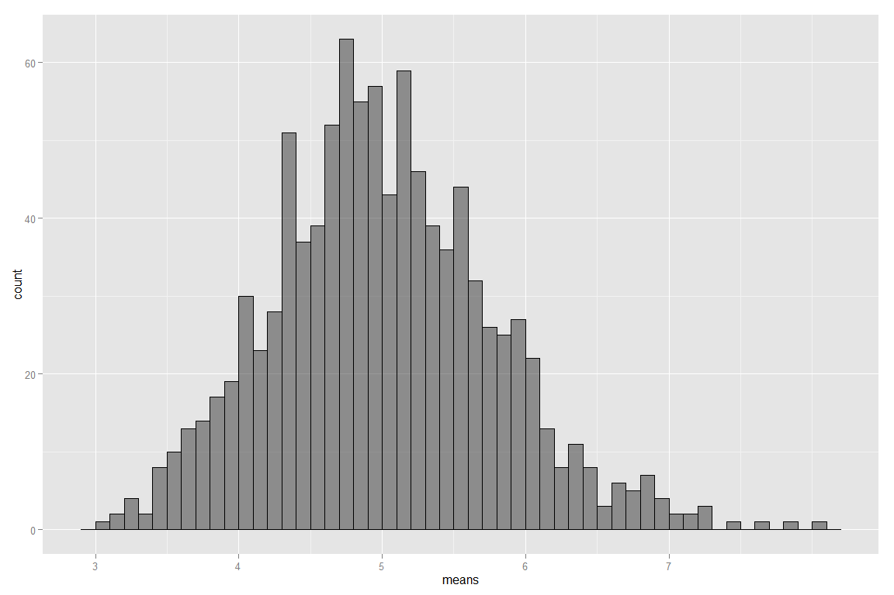
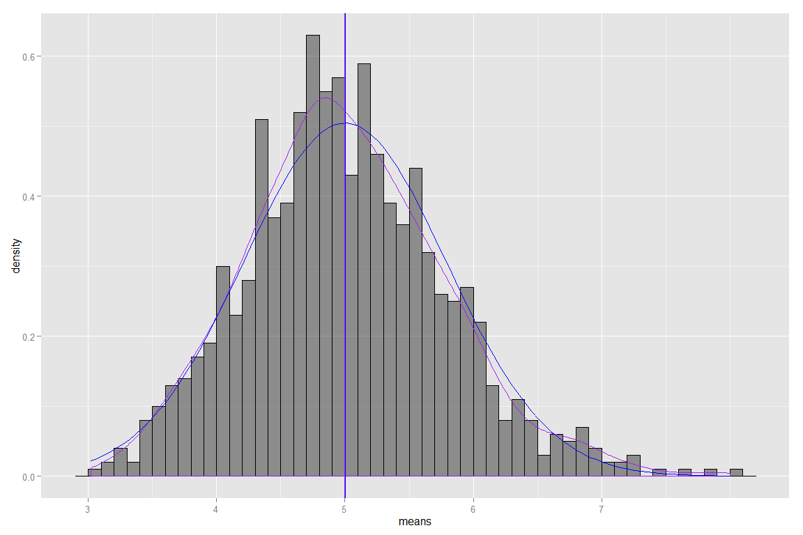

#Statistical Inference
###Course Project 1: CP1_template


###Introduction
This document presents the results of the Course Project for the Coursera course: Statistical Inference. This assessment makes use of simulation techniques in order to explore inference and do some simple inferential data analysis.

The student is to investigate the exponential distribution in R and to draw comparison against the Central Limit Theorem. The exponential distribution can be simulated in R with rexp(n, lambda) where lambda is the rate parameter. The mean of exponential distribution is 1/lambda and the standard deviation is also 1/lambda.

The student is to investigate the distribution of averages of 40 exponentials, with a thousand simulations.


###1. Load Packages

```r
for (package in c('ggplot2')) {
 
    if (!require(package, character.only = TRUE, quietly = FALSE)) {
        install.packages(package)
        library(package, character.only = TRUE)
    }
}
```


###2. Simulations
Set lambda for exponential function, number of exponentials and numbers of sample/tests.

```r
set.seed(123456789)

val_lambda <- 0.2
val_n <- 40
val_sims <- 1000
```

Run sample/tests.

```r
data_expdist <- data.frame(means = 1:val_sims)

for (i in 1:val_sims) {
 
  val_sim <- rexp(val_n, val_lambda)
  data_expdist[i, 1] <- mean(val_sim)
 
}

remove(val_sim)
```

Find range and plot sampled data.

 


###3. Sample Mean vs. Theoretical Mean
Find the theoretical mean of the exponential distribution

```r
val_truemu <- 1/val_lambda
val_truemu
```

```
## [1] 5
```

Find the mean of the sampled distribution

```r
val_samplemu <- mean(data_expdist$means)
val_samplemu
```

```
## [1] 5.005439
```


###4. Sample Variance vs. Theoretical Variance
Find the theoretical variance of the exponential distribution

```r
val_truevar <- (1/val_lambda/sqrt(val_n))^2
val_truevar
```

```
## [1] 0.625
```

Find the variance of the sampled distribution

```r
val_samplevar <- var(data_expdist$means)
val_samplevar
```

```
## [1] 0.6010095
```


###5. Distribution
Plot sampled means against true mean distribution

 

Evaluate the coverage of confidence intervals for a standard normal distribution:

```r
  mean(data_expdist$means) + c(-1,1) * 1.96 * sd(data_expdist$means)/sqrt(nrow(data_expdist))
```

```
## [1] 4.957389 5.053490
```
