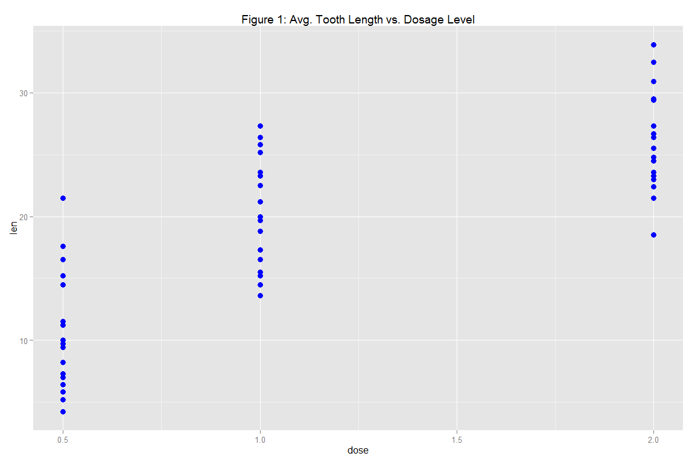

#Statistical Inference
###Course Project 2: CP2_template


###Introduction
This document presents the results of the Course Project for the Coursera course: Statistical Inference. This assessment makes use of statistical techniques in order to explore the relationship between the tooth size of guinea pigs and vitamin dosage levels.


###Data
This assignment makes use of the 'toothgrowth' data set. The data set consists of measurements of length of guinea pigs teeth. It also states that there are two delivery methods of Vitamin C, orange juice (OJ) and ascorbic acid (VC). They were administered with three dose levels of 0.5, 1, and 2 mg.

* Dataset: [toothgrowth data](https://stat.ethz.ch/R-manual/R-devel/library/datasets/html/ToothGrowth.html)

It consists of 60 observations on 3 variables.


###1. Load Packages/Data

```r
for (package in c('ggplot2', 'plyr')) {
 
    if (!require(package, character.only = TRUE, quietly = FALSE)) {
        install.packages(package)
        library(package, character.only = TRUE)
    }
}

data(ToothGrowth)
data_tooth <- ToothGrowth
```


###2. Exploratory Data Analysis
Show data summary:

```r
summary(data_tooth)
```

```
##       len        supp         dose      
##  Min.   : 4.20   OJ:30   Min.   :0.500  
##  1st Qu.:13.07   VC:30   1st Qu.:0.500  
##  Median :19.25           Median :1.000  
##  Mean   :18.81           Mean   :1.167  
##  3rd Qu.:25.27           3rd Qu.:2.000  
##  Max.   :33.90           Max.   :2.000
```

Check recorded tooth legnth against dosage level:

```r
ggplot(data_tooth, aes(x = dose, y = len)) + 
  geom_point(size = 3, colour = "blue") +
  ggtitle('Figure 1: Avg. Tooth Length vs. Dosage Level')
```

 
The plot suggests a positive correlation between recorded tooth length and dosage level.


###3. Confidence Interval Analysis
Use confidence intervals and hypothesis tests to compare tooth growth by supplement type and dose level:

```r
ddply(data_tooth, dose ~ supp, function(x) 
  c(mean = mean(x$len),
  sd = sd(x$len),
  conf.int = t.test(x$len)$conf.int))
```

```
##   dose supp  mean       sd conf.int1 conf.int2
## 1  0.5   OJ 13.23 4.459709 10.039717 16.420283
## 2  0.5   VC  7.98 2.746634  6.015176  9.944824
## 3  1.0   OJ 22.70 3.910953 19.902273 25.497727
## 4  1.0   VC 16.77 2.515309 14.970657 18.569343
## 5  2.0   OJ 26.06 2.655058 24.160686 27.959314
## 6  2.0   VC 26.14 4.797731 22.707910 29.572090
```
It is observed that the 'VC'  intervals are pairwise disjoint (95% confidence level). As such, tooth length means are taken as distinct and a positive correlation between recorded tooth length and dosage level is again observed.

The 'OJ' intervals however, are overlapped between the 1.0 and 2.0 dosage levels. Therefore, explicit tests for these dosages are performed:

```r
val_ttest1 <- t.test(len ~ dose, paired = FALSE, var.equal = TRUE, data = subset(data_tooth, dose %in% c(1.0, 2.0) & supp == 'OJ'))
val_ttest2 <- t.test(len ~ supp, paired = FALSE, var.equal = FALSE, data = subset(data_tooth, dose == 2.0))

data.frame(row.names = c("'1.0 OJ dose' vs '2.0 OJ dose'", "'2.0 OJ dose' vs '2.0 VC dose'"),
  "p-value" = c(val_ttest1$p.value, val_ttest2$p.value),
  "Conf-Low" = c(val_ttest1$conf[1], val_ttest2$conf[1]),
  "Conf-High" = c(val_ttest1$conf[2], val_ttest2$conf[2]))
```

```
##                                  p.value  Conf.Low  Conf.High
## '1.0 OJ dose' vs '2.0 OJ dose' 0.0373628 -6.500502 -0.2194983
## '2.0 OJ dose' vs '2.0 VC dose' 0.9638516 -3.798070  3.6380705
```
For 'OJ', it is observed that the mean length for a 1.0 dosage level is greater than the mean length for a 2.0 dosage level (p-value = 0.037). For the 2.0 dosage level however, it is observed that the difference between type of supplement is insignificant (p-vale = 0.964).


###4. Conclusion
Analysis has shown positive correlation between dosage levels and the tooth size of guinea pigs. For lower level dosages (0.5mg and 1.0mg), Orange Juice supplement has an advantage over the Vitamin C supplement. However for the 2.0mg dosage level there is no significant difference between the type of supplement used.
