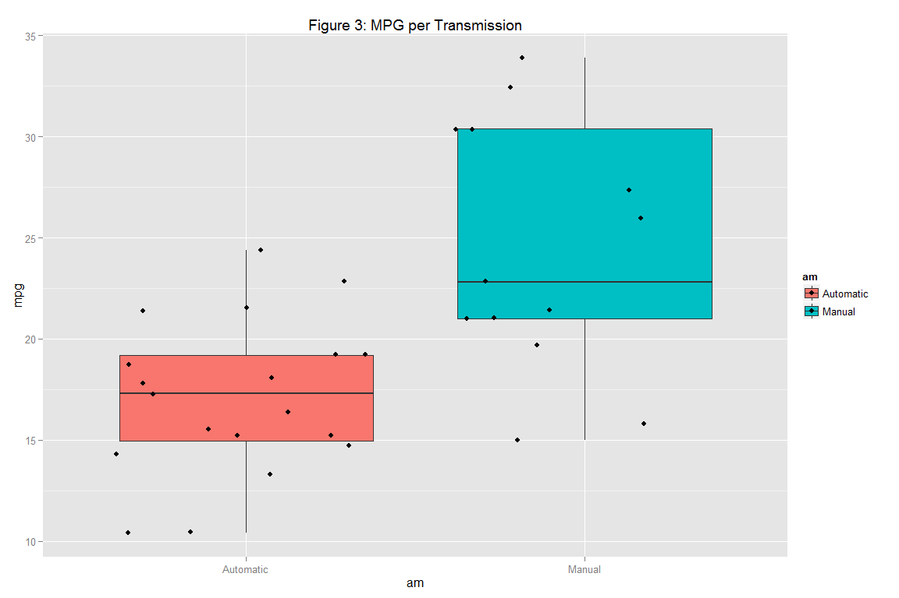
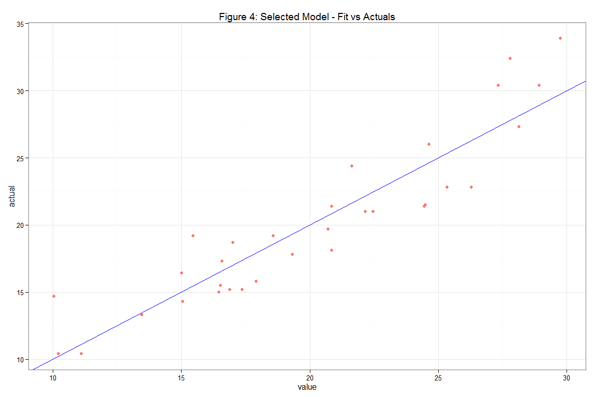
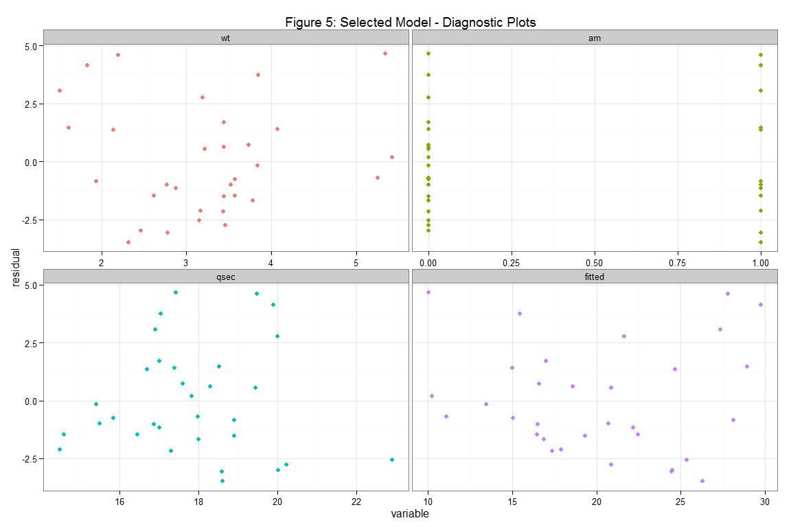

#Regression Models
###Peer Assessment 1: PA1_template


###Introduction
This document presents the results of Peer Assessment 1 for the Coursera course: Regression Models. This assessment required analysis on a data set of a collection of cars. In particular, exploring the relationship between a set of variables and miles per gallon.


###Data
This assignment makes use of the 'mtcars' data set. The data was extracted from the 1974 Motor Trend US magazine, and comprises fuel consumption and 10 aspects of automobile design and performance for 32 automobiles (1973-74 models). 

* Dataset: [mtcars data](https://stat.ethz.ch/R-manual/R-devel/library/datasets/html/mtcars.html)

It consists of 32 observations on 11 variables:

* `mpg`: Miles per US gallon
* `cyl`: Number of cylinders
* `disp`: Displacement (cubic inches)
* `hp`: Gross horsepower
* `drat`: Rear axle ratio
* `wt`: Weight (lb / 1000)
* `qsec`: 1 / 4 mile time
* `vs`: V/S
* `am`: Transmission (0 = automatic, 1 = manual)
* `gear`: Number of forward gears
* `carb`: Number of carburetors

 
###1. Loading Data/Packages

```r
for (package in c('ggplot2', 'stats', 'graphics', 'GGally', 'caret', 'reshape2')) {
  
    if (!require(package, character.only = TRUE, quietly = FALSE)) {
        install.packages(package)
        library(package, character.only = TRUE)
    }
}

data(mtcars)
data_mtcars <- mtcars
```


###2. Subset and Plot Relevant Data:

```r
data_mpgtrans <- data.frame(
  mpg = data_mtcars[, 1],
  cyl = data_mtcars[, 2],
  disp = data_mtcars[, 3],
  hp = data_mtcars[, 4],
  drat = data_mtcars[, 5],
  wt = data_mtcars[, 6],
  qsec = data_mtcars[, 7],
  vs = data_mtcars[, 8],
  am = factor(data_mtcars[, 9], labels = c("Automatic", "Manual")),
  gear = data_mtcars[, 10],
  carb = data_mtcars[, 11])
```


###3. Exploratory Data Analysis:
The appendix contains figures used for basic exploratory data analysis.

Figure 1 shows pair relationships between each variable categorised by 'am'. At a high level, the pair relationships suggest correlation between many of the dataset variables. 'mpg' in particular seems to have a strong correlation with variables 'cyl', 'disp', 'hp' and 'wt'. Figure 2 shows a histogram of 'mpg' also categorised by 'am'. No outliers are identified, however the distribution does seem to exhibit a slight positive skew. Finally, figure 3 shows a boxplot between 'mpg' and 'am'. This figure suggests manual cars achieve greater mpg than automatic cars.


###4. Statistical Inference:
####Test null hypothesis that there is no difference between automatic and manual cars in terms of mpg:

```
## 
## 	Welch Two Sample t-test
## 
## data:  data_mpgtrans.at and data_mpgtrans.mt
## t = -3.7671, df = 18.332, p-value = 0.001374
## alternative hypothesis: true difference in means is not equal to 0
## 95 percent confidence interval:
##  -11.280194  -3.209684
## sample estimates:
## mean of x mean of y 
##  17.14737  24.39231
```
Based on the reported p-value and using 0.05 as the criteria, the null hypothesis should be rejected. This suggests a statistical significant difference between automatic car and manual car in terms of achieved mpg.


###5. Model Selection:
####Create models with various selection method and criteria:

Several linear regression models are built, each using 'mpg' as the dependent variable.

####Model 1: Linear model to explain mpg as a function of transmission type.

```
## 
## Call:
## lm(formula = .outcome ~ ., data = dat)
## 
## Residuals:
##     Min      1Q  Median      3Q     Max 
## -9.3923 -3.0923 -0.2974  3.2439  9.5077 
## 
## Coefficients:
##             Estimate Std. Error t value Pr(>|t|)    
## (Intercept)   17.147      1.125  15.247 1.13e-15 ***
## am             7.245      1.764   4.106 0.000285 ***
## ---
## Signif. codes:  0 '***' 0.001 '**' 0.01 '*' 0.05 '.' 0.1 ' ' 1
## 
## Residual standard error: 4.902 on 30 degrees of freedom
## Multiple R-squared:  0.3598,	Adjusted R-squared:  0.3385 
## F-statistic: 16.86 on 1 and 30 DF,  p-value: 0.000285
```
Model shows significant coefficient for 'am' explanatory variable (p <= 0.05), however model has a low R-square value.


####Model 2: Searched linear model using lmStepAIC method, backward direction.

```
## 
## Call:
## lm(formula = .outcome ~ wt + qsec + am, data = dat)
## 
## Residuals:
##     Min      1Q  Median      3Q     Max 
## -3.4811 -1.5555 -0.7257  1.4110  4.6610 
## 
## Coefficients:
##             Estimate Std. Error t value Pr(>|t|)    
## (Intercept)   9.6178     6.9596   1.382 0.177915    
## wt           -3.9165     0.7112  -5.507 6.95e-06 ***
## qsec          1.2259     0.2887   4.247 0.000216 ***
## am            2.9358     1.4109   2.081 0.046716 *  
## ---
## Signif. codes:  0 '***' 0.001 '**' 0.01 '*' 0.05 '.' 0.1 ' ' 1
## 
## Residual standard error: 2.459 on 28 degrees of freedom
## Multiple R-squared:  0.8497,	Adjusted R-squared:  0.8336 
## F-statistic: 52.75 on 3 and 28 DF,  p-value: 1.21e-11
```
Model shows significant coefficient for all included explanatory variables (p <= 0.05), 83% adjusted R-squared value.


####Model 3: Searched linear model using lmStepAIC method, forward direction.

```
## 
## Call:
## lm(formula = .outcome ~ cyl + disp + hp + drat + wt + qsec + 
##     vs + am + gear + carb, data = dat)
## 
## Residuals:
##     Min      1Q  Median      3Q     Max 
## -3.4506 -1.6044 -0.1196  1.2193  4.6271 
## 
## Coefficients:
##             Estimate Std. Error t value Pr(>|t|)  
## (Intercept) 12.30337   18.71788   0.657   0.5181  
## cyl         -0.11144    1.04502  -0.107   0.9161  
## disp         0.01334    0.01786   0.747   0.4635  
## hp          -0.02148    0.02177  -0.987   0.3350  
## drat         0.78711    1.63537   0.481   0.6353  
## wt          -3.71530    1.89441  -1.961   0.0633 .
## qsec         0.82104    0.73084   1.123   0.2739  
## vs           0.31776    2.10451   0.151   0.8814  
## am           2.52023    2.05665   1.225   0.2340  
## gear         0.65541    1.49326   0.439   0.6652  
## carb        -0.19942    0.82875  -0.241   0.8122  
## ---
## Signif. codes:  0 '***' 0.001 '**' 0.01 '*' 0.05 '.' 0.1 ' ' 1
## 
## Residual standard error: 2.65 on 21 degrees of freedom
## Multiple R-squared:  0.869,	Adjusted R-squared:  0.8066 
## F-statistic: 13.93 on 10 and 21 DF,  p-value: 3.793e-07
```
Model shows insignificant coefficient for all included explanatory variables (p <= 0.05), 80% adjusted R-squared value.

####Select optimal model:

Of the three tested models, model 2 is selected as it has the highest adjusted R-squared value with significant explanatory variables (p <= 0.05).


###6. Regression Analysis:
The coefficients for the selected model suggest that (when holding all other explanatory variables constant), an increase in 'wt' results in a decrease in 'mpg', an increase in 'qsec' results in an increase in 'mpg', and finally, cars with manual transmissions ('am' = 1) provide an increase in 'mpg'.


Figure 4 suggest that the selected model provides a good fit to actual 'mpg' data. Figure 5 shows fitted residuals which are randomly scattered with no particular pattern.


###7. Conclusion:
The selected model suggests that a cars weight, quarter-mile time and transmission type are reasonable explanatory variables to use in determining its mile per gallon performance. Cars with a greater weight, lower (quicker) quarter mile time and automatic transmissions achieve less miles per gallon, while cars with less weight, higher (slower) quarter mile times and manual transmission achieve greater miles per gallon.


###8. Appendix:
 

 

 

 

 
